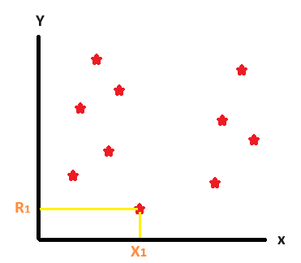
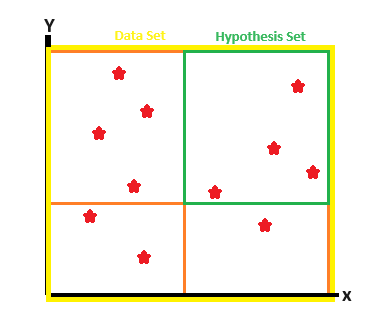
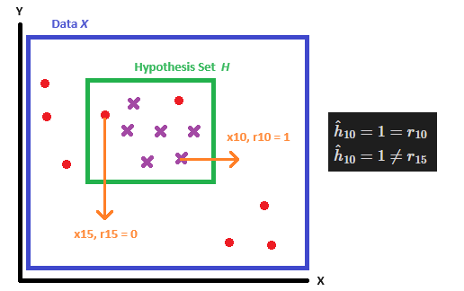

`EE320804 Machine Learning`

#### Textbook: [Introduction to Machine Learning](https://www.tenlong.com.tw/products/9780262043793)
#### Lecturer: [Prof. LeeHter Yao](https://www.ee.ntut.edu.tw/teacher/teacher2.php?tsn=5)

###  Supervised Learning Definition

What is supervised learning, supervised learning means data in classification, segmentation or any tasks that haved been labeled or recognize by experts or domain knowledge. 

### Training Set $\mathbb{X}$

$\mathbb{X} = \left.\lbrace X_{i}, R_{i} \right \rbrace_{i=1}^{N}$

#### Feature Space

***Definition:*** The *space* of the feature is called feature space, in above example the feature space $two\ dimension$.

Small $x$ represents as the coordinate of the data, which represent as $x = \begin{bmatrix} X_i \\ R_i \end{bmatrix}.$
1. $X^{i} \in R^{d},$ $d$ means the number of features

2. $X^{i} \in R^{k},$ $k$ means the number of classess

### Hypothesis Set *$\mathbb{H}$

Inside the hypothesis set $\mathbb{H},$ there are many elements. These elements are called $h_{i},$ that is to say, the equation of the hypothesis $\mathbb{H}$ is represented as $\mathbb{H} = \lbrace h_{1}, h_{2}, h_{3}, ... h_{n}\rbrace.$ Moreover, the prediction value in the $\mathbb{H}$ is represented as $\mathbb{H} = \lbrace r_{1}, r_{2}, r_{3}, ... r_{n}\rbrace.$

In the prediction of the hypothesis set, sometimes will happen prediction error. These errors' value are calculated by ***logic-function***. It represneted in the $\hat{h}(\cdot).$

### *Logic Function*

In *Preceptron Learning Algorithm* (PLA), the output of the PLA is tpycially either 0 (representing False) or 1 (representing *True*). During the learning process, there may be instances of prediction erros, a penalty function, logic function, is used to calculate the error prediction value. Therefore, we use logic function, $E(h|X),$ to calculate it while an error prediction occurs.
#### Equation of the Logic Function

$E(h|X) = \Sigma_{t=1}^{N}\ \mathbb{1}(h(x^{t}) \neq r^{t})$

##### Details in Equation of Logic Function

$\mathbb{1}(\cdot)$ is a logic function, which output is binary, 0 (False) or 1 (True).